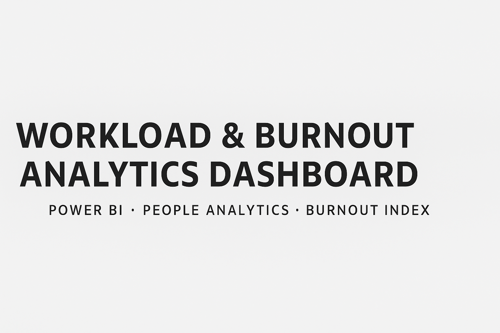
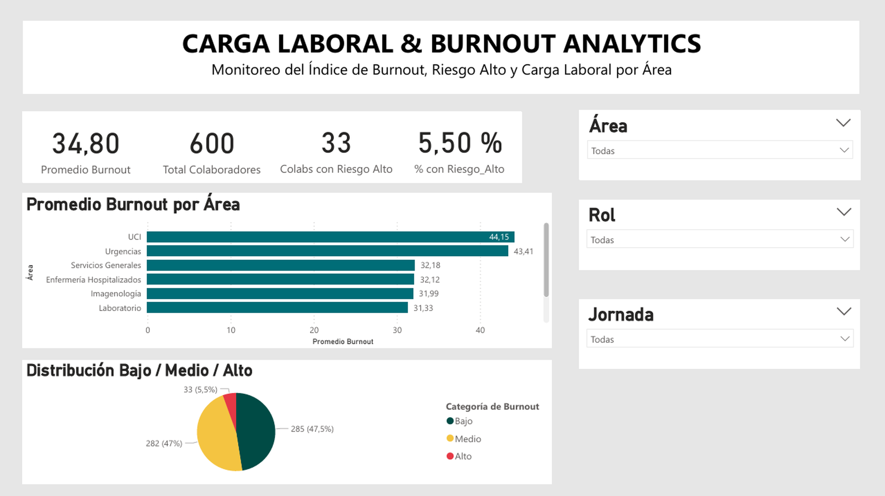
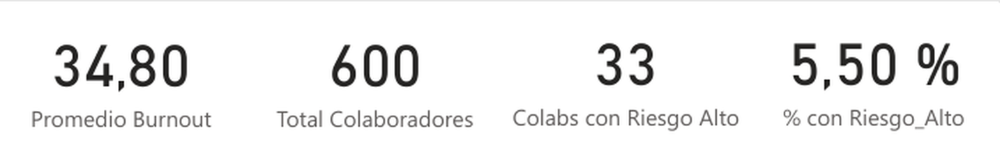
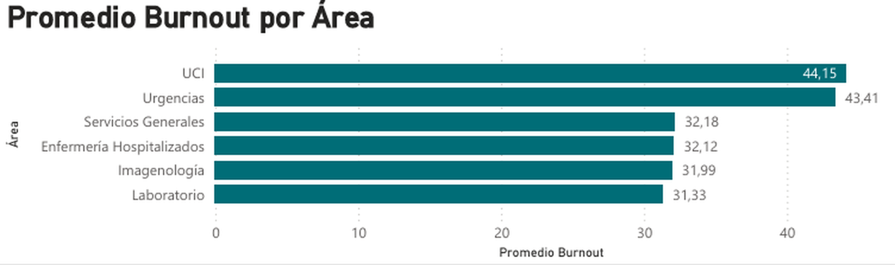
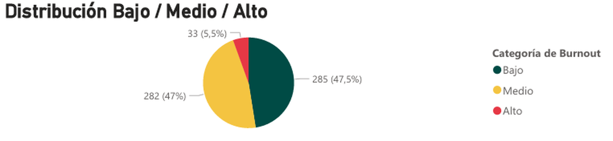

# Workload & Burnout Analytics Dashboard  
### Monitoring Burnout Index, High-Risk Employees, and Burnout Distribution by Department

This project analyzes employee burnout levels across an organization of 600 workers using **Power BI**, **Google Sheets**, and **People Analytics** principles.  
The dashboard identifies high-risk employees, highlights department-level patterns, and supports data-driven decision-making to improve workplace well-being.

---

## Dashboard Overview  


---

## Project Methodology

### 1. Data Cleaning & Standardization
- Removal of duplicated or inconsistent records  
- Adjustment of original burnout scale:  
  - Original scale: **0–60**  
  - Final scale: **0–10**  
- Creation of risk categories:  
  - **Low**  
  - **Medium**  
  - **High**

### 2. KPI Calculations with DAX

```DAX
BurnoutIndex_Final =
DIVIDE(Cargalaboral[BurnoutIndex_NEW], 6)

Total Colaboradores =
COUNTROWS(Cargalaboral)

Colabs Riesgo Alto =
CALCULATE(
    COUNTROWS(Cargalaboral),
    Cargalaboral[Burnout_Categoria] = "Alto"
)

Porcentaje_Riesgo_Alto =
DIVIDE([Colabs Riesgo Alto], [Total Colaboradores])
```

---

## 📌 Key Performance Indicators (KPIs)  


- **Average Burnout Score**  
- **Total Employees: 600**  
- **Employees at High Risk: 33**  
- **% of High-Risk Employees: 5.5%**

---

## 📊 Included Visualizations

### 🔍 Burnout Average by Department  


### 📈 Low / Medium / High Distribution  


Additional visuals include:
- Department comparison  
- Category distribution  
- Slicers for **Department**, **Role**, and **Shift type**

---

## 🧰 Tools & Technologies

- **Power BI**  
- **Google Sheets**  
- **DAX (Data Analysis Expressions)**  
- **GitHub**  
- **People Analytics**

---

## 📁 Repository Structure

```
/Burnout-Analytics-Dashboard
    ├── Burnout.pbix               # Main Power BI dashboard file
    ├── data/                      # Clean dataset
    ├── images/                    # Dashboard images and previews
    └── README.md                  # Project documentation
```

---

## 🚀 How to Use This Project

1. Download the **Burnout.pbix** file  
2. Open it using **Power BI Desktop**  
3. (Optional) Connect your own HR dataset  
4. Explore insights by department, category, and risk level  

---

## Key Insights

- Clinical departments show higher burnout levels  
- 33 employees are categorized as **High Risk**  
- Burnout distribution shows a majority in **Low** and **Medium**  
- The 5.5% high-risk rate helps prioritize targeted interventions  

---

## Author

**Camila Álvarez**  
Physical Activity Specialist, Workplace Wellness & People Analytics  
GitHub: https://github.com/Cami2025  

---

## ⭐ Support the Project

If you found this project useful, feel free to give the repository a **⭐ star**!  
Your support helps showcase my work and encourages the creation of more analytics projects.
